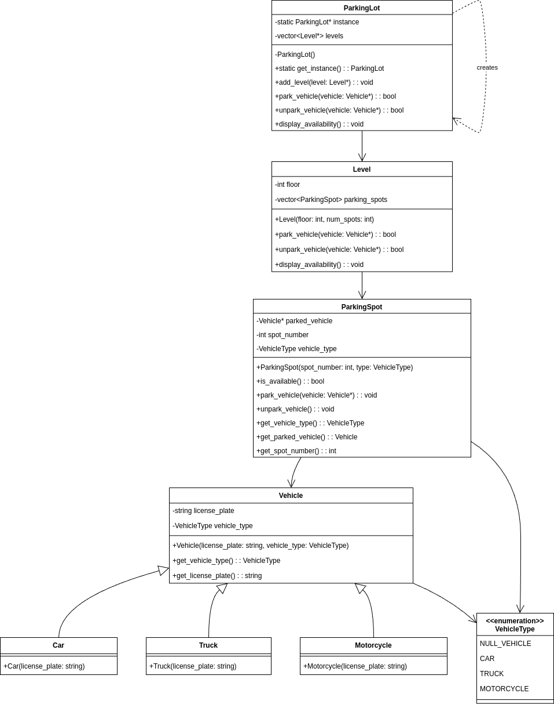
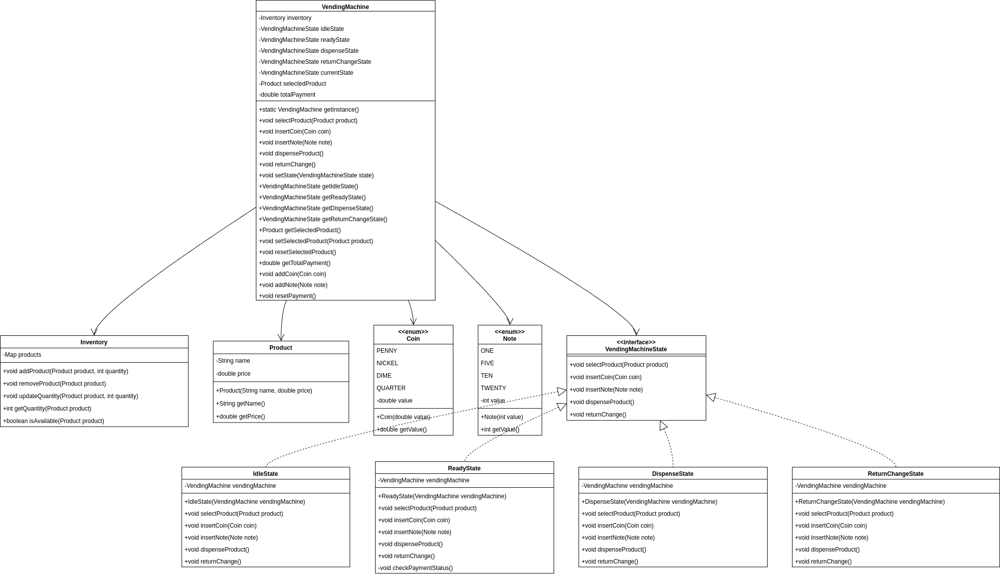

# Low Level Design Projects Archive

This repository contains the projects that I have built while learning low level design. The implementation of the projects is in C++. Along with their UML diagrams.

## Project List

- [Parking Lot](#1-parking-lot)
- [Vending Machine](#2-vending-machine)

## 1. Parking Lot

### Requirements:

1. The parking lot should have multiple levels, each level with a certain number of parking spots.
2. The parking lot should support different types of vehicles, such as cars, motorcycles, and trucks.
3. Each parking spot should be able to accommodate a specific type of vehicle.
4. The system should assign a parking spot to a vehicle upon entry and release it when the vehicle exits.
5. The system should track the availability of parking spots and provide real-time information to customers.
6. The system should handle multiple entry and exit points and support concurrent access.

### Classes:

1. The **ParkingLot** class follows the Singleton pattern to ensure only one instance of the parking lot exists. It maintains a list of levels and provides methods to park and un-park vehicles.
2. The **Level** class represents a level in the parking lot and contains a list of parking spots. It handles parking and un-parking of vehicles within the level.
3. The **ParkingSpot** class represents an individual parking spot and tracks the availability and the parked vehicle.
4. The **Vehicle** class is an abstract base class for different types of vehicles. It is extended by Car, Motorcycle, and Truck classes.
5. The **VehicleType** enum defines the different types of vehicles supported by the parking lot.
6. Multi-threading is achieved through the use of synchronized keyword on critical sections to ensure thread safety.

### UML Diagram:

### Implementation:

- [JAVA](./JAVA/parkinglot)
- [C++](./CPP/parkinglot)

## 2. Vending Machine

### Requirements

1. The vending machine should support multiple products with different prices and quantities.
1. The machine should accept coins and notes of different denominations.
1. The machine should dispense the selected product and return change if necessary.
1. The machine should keep track of the available products and their quantities.
1. The machine should handle multiple transactions concurrently and ensure data consistency.
1. The machine should provide an interface for restocking products and collecting money.
1. The machine should handle exceptional scenarios, such as insufficient funds or out-of-stock products.

### Classes, Interfaces and Enumerations

1. The **Product** class represents a product in the vending machine, with properties such as name and price.
2. The **Coin** and **Note** enums represent the different denominations of coins and notes accepted by the vending machine.
3. The **Inventory** class manages the available products and their quantities in the vending machine. It uses a concurrent hash map to ensure thread safety.
4. The **VendingMachineState** interface defines the behavior of the vending machine in different states, such as idle, ready, and dispense.
5. The **IdleState**, **ReadyState**, and **DispenseState** classes implement the VendingMachineState interface and define the specific behaviors for each state.
6. The **VendingMachine** class is the main class that represents the vending machine. It follows the Singleton pattern to ensure only one instance of the vending machine exists.
7. The VendingMachine class maintains the current state, selected product, total payment, and provides methods for state transitions and payment handling.
8. The **VendingMachineDemo** class demonstrates the usage of the vending machine by adding products to the inventory, selecting products, inserting coins and notes, dispensing products, and returning change.

### UML Diagram

### Implementation:

- [JAVA](./JAVA/vendingmachine)
- [C++](./CPP/vendingmachine)
